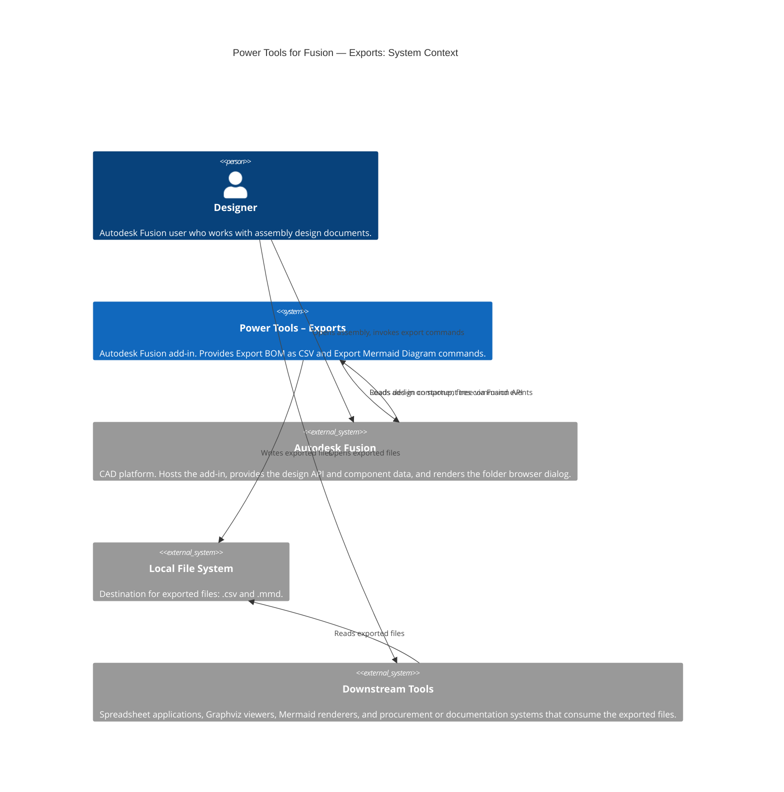

# PowerTools: Export Tools for Autodesk Fusion

Power Tools for Fusion — Exports is an Autodesk Fusion add-in that extends the built-in export capabilities of the platform. It provides commands to export assembly component data and structure to industry-standard formats for use in downstream workflows such as procurement, manufacturing documentation, and architecture visualization.

## Prerequisites

- Autodesk Fusion (any current release)
- Windows 10/11 or macOS 12 or later
- Python runtime included with Autodesk Fusion (no separate installation required)
- (Optional) A Mermaid-compatible viewer to render exported `.mmd` files, such as the [Markdown Preview Mermaid Support](https://marketplace.visualstudio.com/items?itemName=bierner.markdown-mermaid) extension for Visual Studio Code
- The **Export Interactive HTML BOM** command additionally requires the Fusion **Electronics API** (`adsk.electron`), available in the **May 2026 release or newer**, and an active Electronics PCB (or a schematic linked to one). This API is currently a read-only **preview**; see the note under that command's documentation.

## Installation

1. Download or clone this repository to a local folder on your computer.
2. In Autodesk Fusion, open the **Scripts and Add-Ins** dialog by selecting **Tools** > **Scripts and Add-Ins**, or by pressing **Shift+S**.
3. On the **Add-Ins** tab, click the **+** icon and browse to the folder where you cloned the repository.
4. Select **PowerTools-Exports** and click **Open**.
5. Click **Run**. The add-in commands become available in the **File** drop-down menu of any open design document.

To load the add-in automatically each time Autodesk Fusion starts, select the **Run on Startup** check box in the Add-Ins dialog.

## Commands

The following commands are available after installation. Each command is accessible from the **File** drop-down menu in the Quick Access Toolbar (QAT) when a Fusion design document is active.

| Command | Output format | Description |
|---|---|---|
| [Export BOM as CSV](./docs/Export%20BOM.md) | `.csv` | Exports a flat bill of materials containing the display name, part number, material, and instance count for each leaf component in the active assembly. |
| [Export Mermaid Diagram](./docs/Export%20Mermaid.md) | `.mmd` | Exports the full hierarchical component relationship tree as a Mermaid left-to-right flowchart file for rendering in Markdown viewers and web tools. |
| [Export Interactive HTML BOM](./docs/Export%20HTML%20BOM.md) | `.html` | Generates a self-contained interactive HTML BOM from the active Fusion Electronics PCB, reading the board directly via the read-only `adsk.electron` API. Built on a vendored, wx-free subset of [InteractiveHtmlBom](https://github.com/openscopeproject/InteractiveHtmlBom). |

## Accessing commands

All commands appear in the **File** drop-down menu of the Quick Access Toolbar when a Fusion design document is active. No additional toolbar buttons or panel entries are created.

## Architecture

The following C4 context diagram shows the overall system context for the Power Tools — Exports add-in.



## Repository structure

```
PowerTools-Exports/
├── PowerTools-Exports.py          # Add-in entry point (run / stop)
├── PowerTools-Exports.manifest    # Autodesk Fusion add-in manifest
├── config.py                      # Add-in configuration constants
├── commands/
│   ├── exportbomcsv/
│   │   └── entry.py               # Export BOM as CSV command
│   ├── exportmermaid/
│   │   └── entry.py               # Export Mermaid Diagram command
│   └── exporthtmlbom/
│       └── entry.py               # Export Interactive HTML BOM command (Electronics)
├── lib/
│   ├── fusionAddInUtils/          # Shared utility package, vendored identically across all 9 PowerTools add-ins
│   │                              # (logging, events, errors, attributes, cache, date, log, upload helpers)
│   └── interactivehtmlbom/        # Vendored, wx-free subset of InteractiveHtmlBom (MIT) — core/ web/ ecad/
│                                  # used only by the Export Interactive HTML BOM command
└── docs/
    ├── Export BOM.md
    ├── Export Mermaid.md
    └── Export HTML BOM.md
```

## License

This project is released under the [GNU General Public License v3.0 or later](LICENSE).

Copyright (C) 2022-2026 IMA LLC.

The shared library at `lib/fusionAddInUtils` is vendored byte-for-byte identically across all nine PowerTools add-ins. It mixes code under different terms: `general_utils.py`, `event_utils.py`, and `attributes_utils.py` are based on Autodesk, Inc. sample code (distributed under its own license terms — see the source headers); `cache_utils.py`, `date_utils.py`, `log_utils.py`, and `upload_utils.py` are part of this project (IMA LLC, GPL-3.0-or-later). See each module's source header for details.

The library at `lib/interactivehtmlbom` is a trimmed, wx-free copy of [InteractiveHtmlBom](https://github.com/openscopeproject/InteractiveHtmlBom) (Copyright (c) the InteractiveHtmlBom authors, **MIT License**, preserved verbatim at `lib/interactivehtmlbom/LICENSE`) together with the third-party components that project bundles. Those bundled components carry their own licenses: the KiCad *newstroke* stroke font (`core/newstroke_font.py`) is **GPL-2.0-or-later**; lz-string (`web/lz-string.js`, `core/lzstring.py`) is **WTFPL-2.0**; and PEP, Split.js, svgpathtools, and the KiBoM units module are **MIT**. Every one of these is GPL-compatible (permissive, or GPL-2.0-**or-later** which may be used under GPLv3), so the combined work is distributable under this project's GPLv3 with each component's notice preserved. A full inventory with copyright holders, sources, and the complete license texts is at [`lib/interactivehtmlbom/THIRD_PARTY_LICENSES.md`](lib/interactivehtmlbom/THIRD_PARTY_LICENSES.md). The Fusion Electronics adapter (`ecad/fusion_electronics.py`) and the wx-removal edits to `core/ibom.py` and `core/config.py` are derivative modifications noted in those files' headers.

---

*Copyright © 2026 IMA LLC. All rights reserved.*
