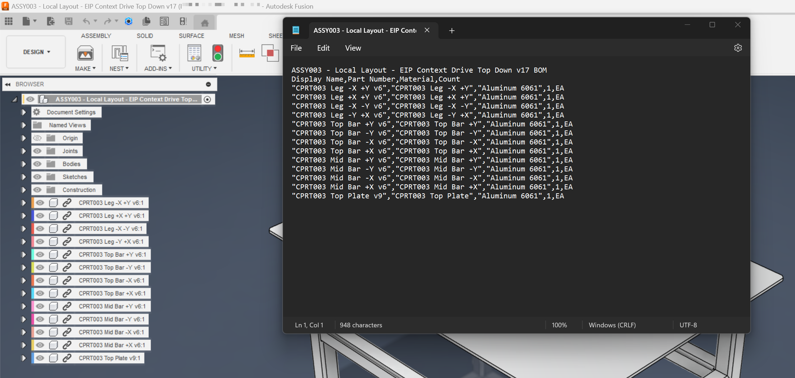
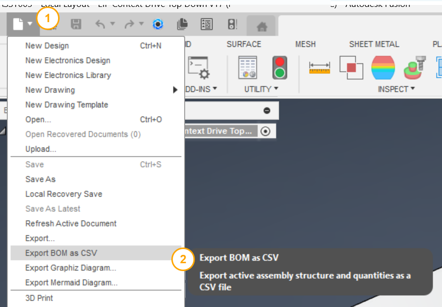
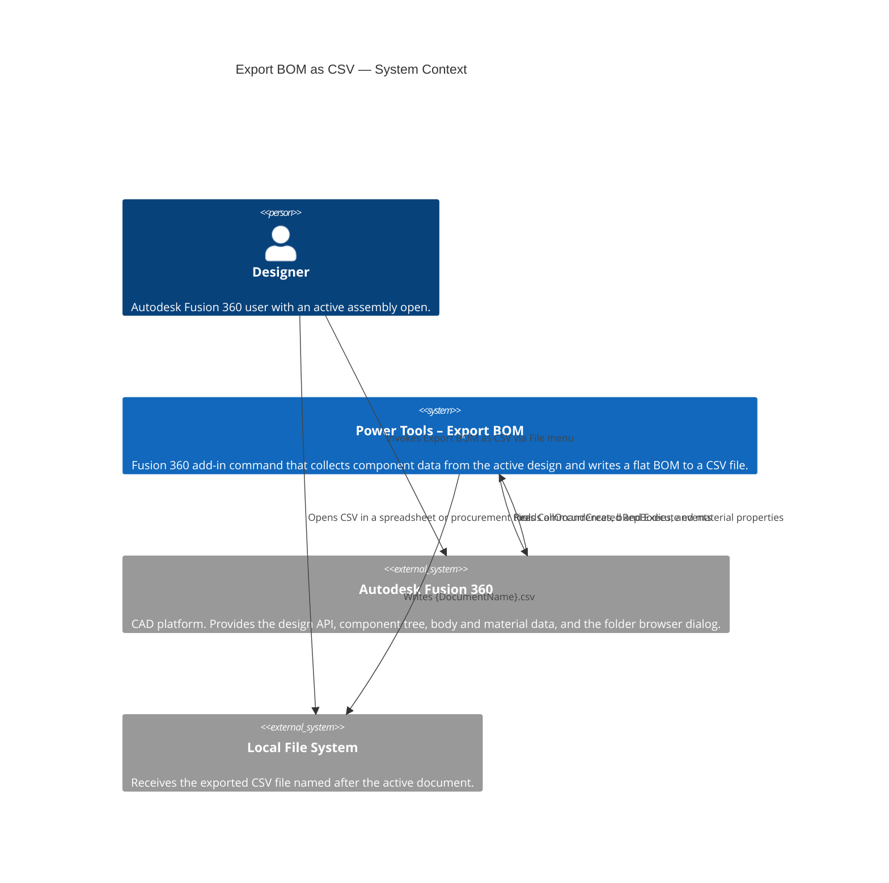

# Export BOM as CSV

[Back to README](../README.md)

## Overview

The **Export BOM as CSV** command exports the bill of materials (BOM) for the active Autodesk Fusion 360 assembly to a comma-separated values (CSV) file. Use this command to share component data with procurement, manufacturing, or project management tools that accept CSV input.

## Prerequisites

- An Autodesk Fusion 360 design document must be active and open.
- The design must contain at least one component.

## How to use this command

1. Open an assembly design in Autodesk Fusion 360.
2. From the **File** drop-down menu in the Quick Access Toolbar, select **Export BOM as CSV**.
3. In the folder browser dialog, navigate to the destination folder for the output file.
4. Click **OK**. Power Tools traverses the assembly and writes the file.
5. A confirmation dialog displays the full path of the exported file.

## Output

Power Tools creates a CSV file named `{DocumentName}.csv` in the folder you selected. The file uses the following columns:

| Column | Description |
|---|---|
| **Display Name** | The component display name as shown in the Fusion browser. For external reference (xref) components, the Fusion version suffix is removed so the name stays consistent across design revisions. |
| **Part Number** | The part number property defined on the component. |
| **Material** | The material assigned to the first solid body of the component. If the component has no solid bodies, this field is empty. |
| **Count** | The total number of instances of this component in the assembly. |
| **Unit** | Always `EA` (each). |

### Flat BOM behavior

By default, the BOM includes only **leaf components** — components that contain geometry but have no child sub-assemblies. Sub-assembly nodes are excluded from the output rows, but their child leaf components are included and counted. This behavior produces a flat BOM that is suitable for procurement and manufacturing.

### Version handling

For components that are external references, Power Tools automatically removes the Fusion version suffix from the display name. For example, `Bracket v3` is written as `Bracket`. This keeps the exported names stable across design revisions without requiring manual edits to the CSV.

## Example output

```
Display Name,Part Number,Material,Count
"Bracket","BRK-001","Steel",4,EA
"Cap Screw M6","HDW-010","Stainless Steel",16,EA
"Base Plate","PLT-002","Aluminum",1,EA
```



## Access

From the design document's **File** drop-down menu in the Quick Access Toolbar, select **Export BOM as CSV**.



---

## Architecture

### System context

The following C4 context diagram shows how the **Export BOM as CSV** command interacts with Autodesk Fusion 360 and the local file system.



### Command processing flow

The following diagram shows the internal processing steps that run when the command executes.

```mermaid
flowchart TD
    A([User selects Export BOM as CSV]) --> B[CommandExecute event fires]
    B --> C{Active product\nis a Fusion Design?}
    C -- No --> D[Show error:\nA Design Must be Active]
    C -- Yes --> E[Get rootComponent.allOccurrences]
    E --> F[Iterate all occurrences\nBuild unique component list]
    F --> G{Component already\nin BOM list?}
    G -- Yes --> H[Increment instance count]
    G -- No --> I[Resolve display name\nStrip version suffix if xref]
    I --> J[Read material from\nfirst solid bRepBody]
    J --> K[Append new row to BOM list]
    H --> L{More occurrences?}
    K --> L
    L -- Yes --> F
    L -- No --> M[Generate CSV string\nHeader + leaf component rows]
    M --> N[Show folder picker dialog]
    N --> O{User confirmed\ndestination folder?}
    O -- No --> P([Exit — no file written])
    O -- Yes --> Q[Write {DocumentName}.csv]
    Q --> R[Show confirmation message\nwith full file path]
    R --> P
```

---

[Back to README](../README.md)

*Copyright IMA LLC*
