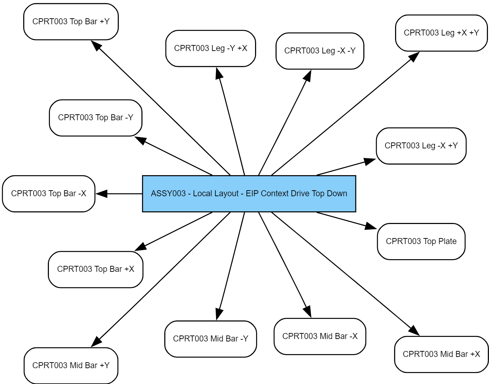
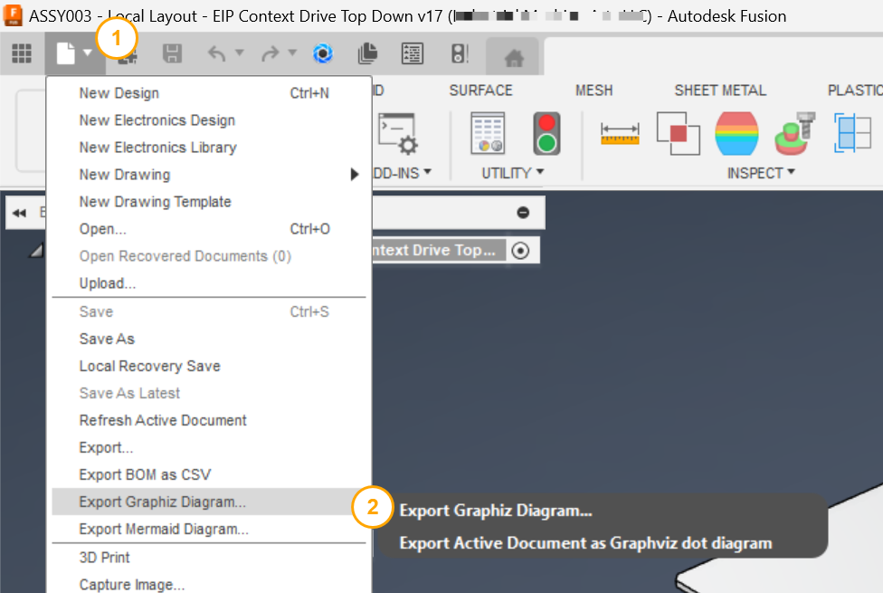
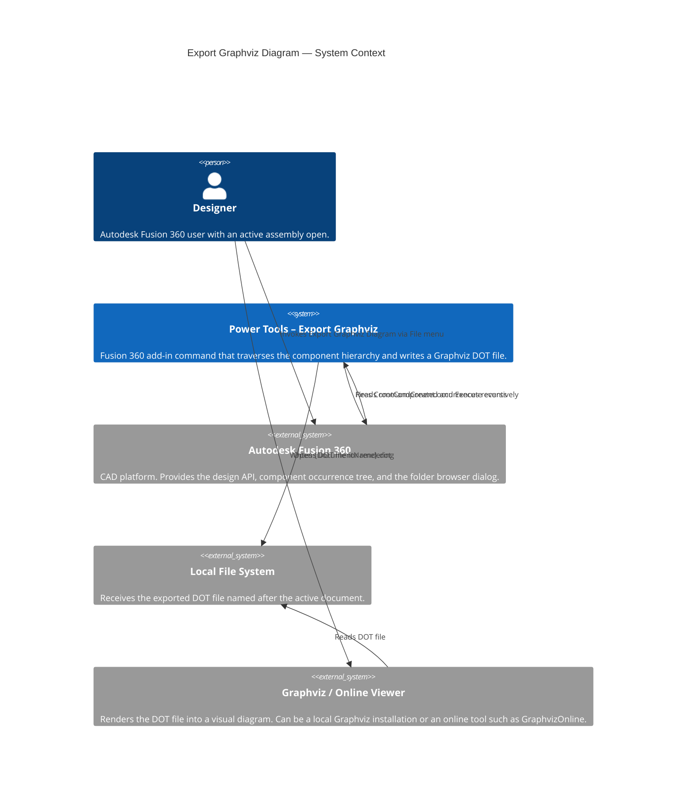

# Export Graphviz Diagram

[Back to README](../README.md)

## Overview

The **Export Graphviz Diagram** command exports the component hierarchy of the active Autodesk Fusion 360 assembly as a [Graphviz](https://www.graphviz.org/) DOT file. The resulting file represents the full parent-child relationship tree and can be rendered into a visual diagram using Graphviz tools or compatible viewers.

## Prerequisites

- An Autodesk Fusion 360 design document must be active and open.
- The design must contain at least one component with child components or sub-assemblies.
- To render the exported `.dot` file, install [Graphviz](https://www.graphviz.org/download/) locally or use an [online Graphviz viewer](https://dreampuf.github.io/GraphvizOnline).

## How to use this command

1. Open an assembly design in Autodesk Fusion 360.
2. From the **File** drop-down menu in the Quick Access Toolbar, select **Export Graphviz Diagram...**.
3. In the folder browser dialog, navigate to the destination folder for the output file.
4. Click **OK**. Power Tools traverses the assembly and writes the file.
5. A confirmation dialog displays the full path of the exported file.

> **Note (macOS only):** If Graphviz is installed at `/Applications/Graphviz.app`, Power Tools automatically opens the exported diagram after the file is written. This behavior is not yet available on Windows.

## Output

Power Tools creates a DOT file named `{DocumentName}.dot` in the folder you selected. The file is a directed graph (`digraph`) with the following properties:

| Property | Value | Description |
|---|---|---|
| Layout engine | `twopi` | Radial layout; the root assembly is placed at the center. |
| Node shape | `box` (rounded) | Each component appears as a rounded rectangle. |
| Node font | Helvetica, 8 pt | Compact labeling for large assemblies. |
| Root node fill | `lightskyblue` | The top-level assembly node is visually distinct. |
| Edge style | Curved, `concentrate=true` | When a component is referenced multiple times, only one edge is drawn to reduce visual clutter. |
| Overlapping nodes | Disabled | The layout engine separates nodes to avoid overlap. |

### Version handling

Power Tools removes the Fusion version suffix from both parent and child component names. For example, `Sub-Assembly v2` is written as `Sub-Assembly`. This keeps diagram labels consistent across design revisions.

### Component uniqueness

Every component in the assembly appears once per occurrence edge. If the same component is used in multiple sub-assemblies, an edge is drawn for each usage. The `concentrate=true` setting merges parallel edges when they share the same source and target, keeping the diagram readable.

## Rendering the output

Use one of the following options to render the exported `.dot` file:

- **Online:** Open [GraphvizOnline](https://dreampuf.github.io/GraphvizOnline) in a browser and paste the file contents.
- **Local (Windows):** [Download and install Graphviz](https://www.graphviz.org/download/), then run `dot -Tpng MyAssembly.dot -o MyAssembly.png` in a terminal.
- **Local (macOS):** Install Graphviz via Homebrew (`brew install graphviz`) or download the installer. Power Tools attempts to open the diagram automatically after export if Graphviz is installed at `/Applications/Graphviz.app`.

## Example output



## Access

From the design document's **File** drop-down menu in the Quick Access Toolbar, select **Export Graphviz Diagram...**.



---

## Architecture

### System context

The following C4 context diagram shows how the **Export Graphviz Diagram** command interacts with Autodesk Fusion 360 and external rendering tools.



### Command processing flow

The following diagram shows the internal processing steps that run when the command executes.

```mermaid
flowchart TD
    A([User selects Export Graphviz Diagram]) --> B[CommandExecute event fires]
    B --> C{Active product\nis a Fusion Design?}
    C -- No --> D[Show error:\nIncorrect Document Type]
    C -- Yes --> E[Get rootComponent and document name]
    E --> F[Initialize DOT string\ndigraph header and global style attributes]
    F --> G[Add root node\nfilled lightskyblue]
    G --> H[traverseAssembly:\nIterate rootComponent.occurrences]
    H --> I[Trim version from\nparent and child names]
    I --> J[Write directed edge:\nparent -&#62; child]
    J --> K{Child has\nchild occurrences?}
    K -- Yes --> L[Recurse into\nchild occurrences]
    L --> I
    K -- No --> M{More occurrences\nat this level?}
    M -- Yes --> I
    M -- No --> N[Close DOT string with closing brace]
    N --> O[Show folder picker dialog]
    O --> P{User confirmed\ndestination folder?}
    P -- No --> Q([Exit — no file written])
    P -- Yes --> R[Write {DocumentName}.dot]
    R --> S[Show confirmation message\nwith full file path]
    S --> T{Running\non macOS?}
    T -- Yes --> U[Attempt to open\nin Graphviz.app]
    T -- No --> Q
    U --> Q
```

---

[Back to README](../README.md)

*Copyright IMA LLC*
