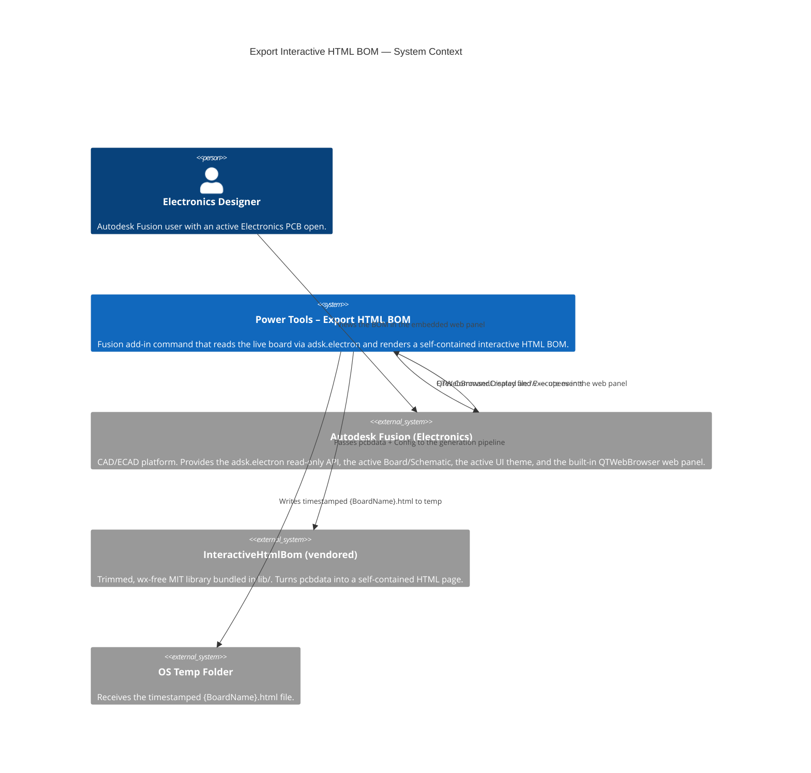
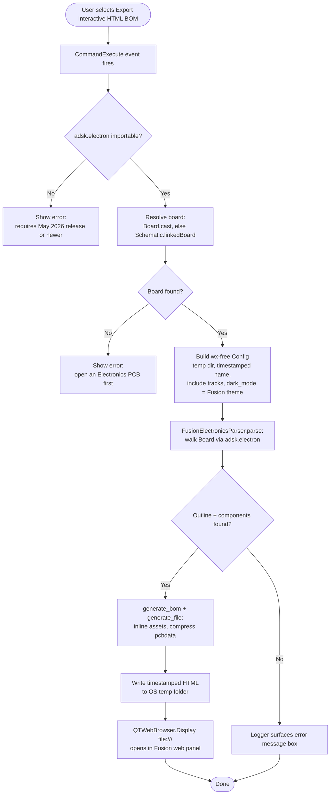

# Export Interactive HTML BOM

[Back to README](../README.md)

## Overview

The **Export Interactive HTML BOM** command generates a single, self-contained interactive HTML bill of materials from the active Autodesk Fusion **Electronics** PCB and opens it directly in Fusion's built-in web panel. The page lets you cross-probe between the BOM table and a rendered board view — no server, plugins, or network access required. The board is read directly from the live design through the read-only `adsk.electron` API, so no intermediate file export is needed. The report automatically follows Fusion's active **light/dark theme** and uses the Fusion UI palette.

This command is built on a trimmed, GUI-free (wx-removed) copy of the open-source [InteractiveHtmlBom](https://github.com/openscopeproject/InteractiveHtmlBom) project (MIT), vendored at `lib/interactivehtmlbom`. That subset also bundles several third-party components under their own (GPL-compatible) licenses — see [`lib/interactivehtmlbom/THIRD_PARTY_LICENSES.md`](../lib/interactivehtmlbom/THIRD_PARTY_LICENSES.md).

## Prerequisites

- The Fusion **Electronics API** (`adsk.electron`), available in the **May 2026 release or newer**.
- An active **Electronics PCB** document, **or** an active **Schematic** that is linked to a board. The command resolves the board from either.
- A defined **board outline** on the Dimension layer (layer 20). The generator needs the outline to compute the board extents.

> **Preview API notice.** As of the May 2026 release, `adsk.electron` is a read-only **preview** API. Autodesk states that preview capabilities may change in ways that break dependent programs, and advises against shipping production tools that rely on them. Treat this command as preview-grade and pin it to a known-good Fusion release range. A file-based EAGLE (`.brd`) fallback path exists in the vendored `ecad/eagle.py` for environments where the live API is unavailable.

## How to use this command

1. Open an Electronics design and switch to its **2D PCB** document (or open the linked schematic).
2. From the **File** drop-down menu in the Quick Access Toolbar, select **Export Interactive HTML BOM**.
3. Power Tools walks the board via `adsk.electron`, builds the BOM, writes the HTML to the OS temporary folder, and opens it in Fusion's built-in web panel. There is no folder prompt — the report is displayed in place.

## Output

Power Tools writes `{BoardName}_{date}_{time}.html` to the operating-system temporary folder (`tempfile.gettempdir()`) and displays it in Fusion's embedded Qt web browser via `QTWebBrowser.Display`. The file is fully self-contained: the board geometry (`pcbdata`), the view configuration (including the light/dark theme matching Fusion), and all rendering JavaScript/CSS are compressed and inlined into the single document, so it can also be copied out, emailed, archived, or opened offline in any browser. Each export uses a fresh timestamped name so it never collides with a file the web panel still has open and so the theme always reflects Fusion's current setting.

## Access

From the design document's **File** drop-down menu in the Quick Access Toolbar, select **Export Interactive HTML BOM**.

## Data source mapping

The command reads the board through `adsk.electron` and maps it onto the InteractiveHtmlBom `pcbdata` structure:

| HTML BOM data | `adsk.electron` source |
|---|---|
| Placed components (footprints, position, rotation, side) | `Board.elements` (`.x/.y` in internal units, `.angle`, `.mirror`, `.package`) |
| Pads (position + net + pin 1) | `Package.contacts` (`.x/.y`, `.name`, `.signal`), transformed by element placement |
| Board outline (incl. arcs) | board geometry on the Dimension layer (20), curved wires subdivided |
| Silkscreen graphics + reference/value text | package `wires`/`circles`/`rectangles`, `>NAME`/`>VALUE` placeholders, and `Board.texts` |
| Copper tracks, vias | `Board.signals[].wires` and `.vias` (F.Cu / B.Cu only) |
| Copper pours (zones) | `Board.signals[].polyPours` outlines |
| BOM rows (value, footprint, designators) | `Board.elements` grouped by value/footprint |
| Coordinate units | converted from internal units (1/320000 mm) via `adsk.electron.Units.u2mm` |

> **Pad-geometry limitation.** The May 2026 preview of `adsk.electron` does not expose pad shape/size: `Contact.smd` / `Contact.pad` are always `None`, and there is no `dx`/`drill`/`shape` reachable from a contact. Pads are therefore rendered at each contact's true **position** and **net** (so highlighting and cross-probe work), sized from the contact pitch; exact pad shapes and the SMD/through-hole distinction are not recoverable until the API exposes them. The coordinate transform was validated to 0 mm against a placed part's known pad coordinates. See `lib/interactivehtmlbom/ecad/fusion_electronics.py` for details.

---

## Architecture

### System context

### Command processing flow

---

[Back to README](../README.md)

*Copyright © 2026 IMA LLC. All rights reserved.*
