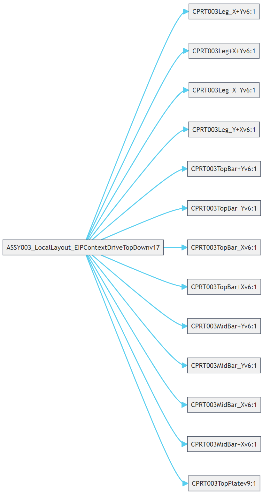
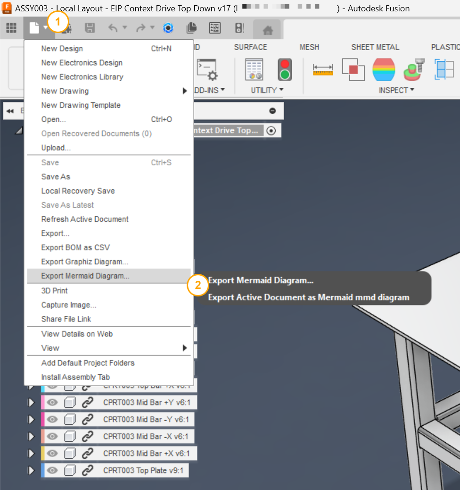
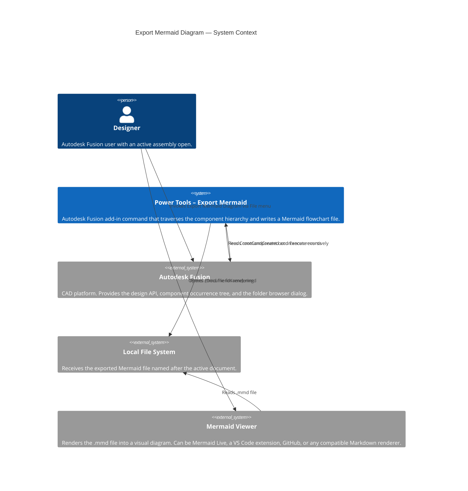

# Export Mermaid Diagram

[Back to README](../README.md)

## Overview

The **Export Mermaid Diagram** command exports the component hierarchy of the active Autodesk Fusion assembly as a [Mermaid](https://mermaid.js.org/) diagram file. The resulting `.mmd` file is a text-based, left-to-right flowchart that represents the full parent-child component relationship tree. It can be rendered in any Mermaid-compatible viewer, including Visual Studio Code extensions, GitHub Markdown, and the Mermaid Live Editor.

## Prerequisites

- An Autodesk Fusion design document must be active and open.
- The design must contain at least one component with child components or sub-assemblies.
- To render the exported `.mmd` file, use one of the following:
  - [Mermaid Live Editor](https://mermaid.live/) (online, no installation required)
  - The [Markdown Preview Mermaid Support](https://marketplace.visualstudio.com/items?itemName=bierner.markdown-mermaid) extension for Visual Studio Code
  - Any Markdown renderer that supports Mermaid (such as GitHub, GitLab, or Notion)

## How to use this command

1. Open an assembly design in Autodesk Fusion.
2. From the **File** drop-down menu in the Quick Access Toolbar, select **Export Mermaid Diagram...**.
3. In the folder browser dialog, navigate to the destination folder for the output file.
4. Click **OK**. Power Tools traverses the assembly and writes the file.
5. A confirmation dialog displays the full path of the exported file.

## Output

Power Tools creates a Mermaid file named `{DocumentName}.mmd` in the folder you selected. The file uses the `graph LR` (left-to-right) flowchart type and includes a theme configuration block at the top.

### Theme

The exported diagram uses the following built-in theme variables:

| Variable | Value | Description |
|---|---|---|
| `theme` | `base` | Uses the Mermaid base theme as a starting point. |
| `primaryColor` | `#f0f0f0` | Light gray fill for component nodes. |
| `primaryBorderColor` | `#454F61` | Dark blue-gray node borders. |
| `lineColor` | `#59cff0` | Light blue connector lines. |
| `tertiaryColor` | `#e1ecf5` | Pale blue background for cluster nodes. |
| `fontSize` | `14px` | Node label font size. |

### Character sanitization

Mermaid diagram syntax does not support certain special characters in node identifiers. Power Tools automatically replaces or removes the following characters in component names before writing:

| Character | Replacement |
|---|---|
| `-` | `_` |
| `"` | *(removed)* |
| `=` | *(removed)* |
| `(` or `)` | *(removed)* |
| `<` or `>` | `_` |
| ` ` (space) | *(removed from relationship strings)* |

### Component relationships

Each parent-child component relationship is written as a Mermaid arrow: `Parent-->Child`. The diagram is built by recursively traversing the assembly tree from the root component downward. If a component appears in multiple locations in the assembly, an arrow is written for each usage.

## Rendering the output

Use one of the following options to view the exported diagram:

- **Online:** Open [Mermaid Live](https://mermaid.live/), paste the file contents, and the diagram renders immediately.
- **Visual Studio Code:** Install the [Markdown Preview Mermaid Support](https://marketplace.visualstudio.com/items?itemName=bierner.markdown-mermaid) extension. Rename the `.mmd` file to `.md`, wrap the content in a `mermaid` fenced code block, and open the Markdown preview.
- **GitHub / GitLab:** Paste the Mermaid content inside a `mermaid` fenced code block in any Markdown file. The diagram renders automatically in the web UI.

## Example output



## Access

From the design document's **File** drop-down menu in the Quick Access Toolbar, select **Export Mermaid Diagram...**.



---

## Architecture

### System context

The following C4 context diagram shows how the **Export Mermaid Diagram** command interacts with Autodesk Fusion and external rendering tools.



### Command processing flow

The following diagram shows the internal processing steps that run when the command executes.

```mermaid
flowchart TD
    A([User selects Export Mermaid Diagram]) --> B[CommandExecute event fires]
    B --> C{Active product\nis a Fusion Design?}
    C -- No --> D[Show error:\nA Design Must be Active]
    C -- Yes --> E[Get rootComponent and document name]
    E --> F[Write Mermaid front matter\ntheme init block]
    F --> G[Write graph LR declaration]
    G --> H[traverseAssembly:\nIterate rootComponent.occurrences]
    H --> I[Sanitize parent and child names\nReplace or remove special characters]
    I --> J[Write relationship string:\nParent--&#62;Child]
    J --> K{Child has\nchild occurrences?}
    K -- Yes --> L[Recurse into\nchild occurrences]
    L --> I
    K -- No --> M{More occurrences\nat this level?}
    M -- Yes --> I
    M -- No --> N[Show folder picker dialog]
    N --> O{User confirmed\ndestination folder?}
    O -- No --> P([Exit — no file written])
    O -- Yes --> Q[Write {DocumentName}.mmd]
    Q --> R[Show confirmation message\nwith full file path]
    R --> P
```

---

[Back to README](../README.md)

*Copyright © 2026 IMA LLC. All rights reserved.*
